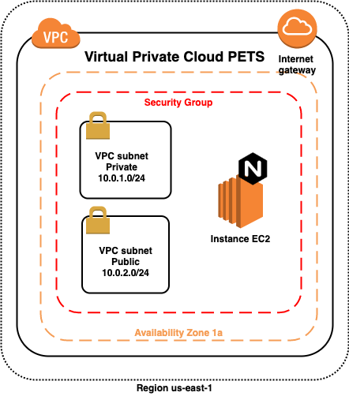

# VPC - Creada en Terraform para AWS



## Primeros Pasos

Los valores de las variables se deben crear en archivos **.json**. De esta forma se tienen valores distintos por ambientes :). Por ejemplo el **tfvars-dev.json**
```
{
   "environment": "dev",
    "table_local": "0.0.0.0/0",
    "ami": "ami-09a5b0b7edf08843d",
    "instance_type": "t2.micro",
    "aws_id": "id-owner-aws",
    "aws_region": "us-east-1",
    "key_name": "nombre-key-creada-previamente-en-AWS",
    "product": "WEBAPP",
    "vpc_cidr": "10.0.0.0/16",
    "cidr_private": "10.0.1.0/24",
    "cidr_public": "10.0.2.0/24",
    "profile": "profile-aws"
}

```


Ahora para ejecutar este projecto en terraform:

```

terraform init
terraform plan var-file="./tfvars-dev.json"
terraform apply -auto-approve -var-file="./tfvars.json"

```